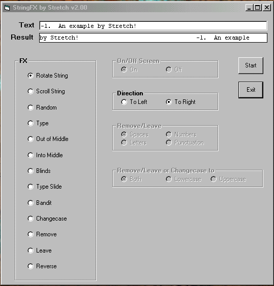



## StringFX v2\.00

### Description

(PLEASE ALSO LOOK AT VERSION 2.10!)This code is an example of 13 different FX that can be easily implemented to a string. I have put them all together and put in quite a few notes explaining what each FX is doing. As you can see from the screenshot each effect can be modified in certain ways. I have written this so that you can have a better understanding of how computers work. I have tried to avoid using many of the built in functions. Each FX may not be the most efficient way of doing them, but I have done it this way to highlight the internal workings. All FX (apart from Rotate) work at a character at a time. Please send in any comments you may have - Good or Bad - so I can improve on it further. If you have any questions then email me. PLEASE RATE THIS. Thankyou.
 
### More Info
 
a headache?

             |
---                |---
**Submitted On**   |2000-05-04 16:21:22
**By**             |[Sentinel](https://github.com/Planet-Source-Code/PSCIndex/blob/master/ByAuthor/sentinel.md)
**Level**          |Beginner
**User Rating**    |4.7 (14 globes from 3 users)
**Compatibility**  |VB 5\.0, VB 6\.0
**Category**       |[String Manipulation](https://github.com/Planet-Source-Code/PSCIndex/blob/master/ByCategory/string-manipulation__1-5.md)
**World**          |[Visual Basic](https://github.com/Planet-Source-Code/PSCIndex/blob/master/ByWorld/visual-basic.md)
**Archive File**   |[CODE\_UPLOAD5495542000\.zip](https://github.com/Planet-Source-Code/sentinel-stringfx-v2-00__1-7855/archive/master.zip)

